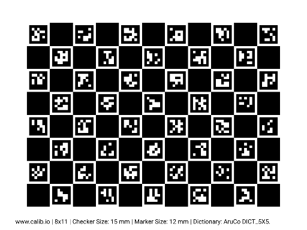
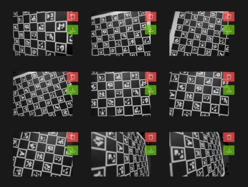

ChArUco Camera Calibration
==================
* :ref:`Steps`

------------------------

.. _Steps:

Performing ChArUco Calibration
~~~~~~~~~~~~~~~~~~~~~~~~~~~~~~~~~~~~~~~~~~

ChArUco calibration with Limelight was designed to be as seamless and bullet-proof as possible. Read the following steps, and then watch the video below to learn how to calibrate your camera for increased accuracy.

Preparing the Board
----------------------------

1. Print a ChArUco Calibration Board. Use `our board from the downloads page <https://downloads.limelightvision.io/models/calib.io_charuco_200x150_8x11_15_12_DICT_5X5.pdf>`_, or `generate your own <https://calib.io/pages/camera-calibration-pattern-generator>`_
2. Find the "width" of the grid by adding the total number of black squares and total number of ArUco markers in one row (11 for the default Limelight calibration board). 
3. Find the "height" of the grid by adding the total number of black squares and total number of ArUco markers in one column (8 for the default Limelight calibration board).
4. Confirm the "square size" and "marker size" measurements by measuring the side lengths of a square and a marker in millimeters. 
 
    * The square size and marker size measurements are critical, so use calipers.

5. Note the dictionary type. The default board from the downloads page uses the 5x5_100 dictionary.

Capturing Calibration Images
----------------------------

1. Ensure your board is as flat as possible. 
    * You should not perform calibration if your board is not flat. You may purchase special boards from calib.io, or fix your printed board to a clipboard.

2. Turn on your robot and access the Limelight web UI.
3. Make a 1280x960 AprilTag pipeline
4. Delete all saved snapshots by changing the "input" source type from "Camera" to "Snapshot" and clicking "Delete all snapshots"
5. Change the "input" source type back to "Camera"
6. Capture at least 25 snapshots of the ChArUco board to begin. Once you're familiar with the process, you'll want to go back to capture a total of at least 50 images.
7. The main advantage of ChArUco calibration over standard checkerboard calibration is that it works even if only part of the board is visible to the camera. It is important to utilize this advantage.
8. Your images should have a good mix of the following qualities:
    * Your board spans large regions of the image
    * Your board extands past at least one edge or corner of the image (This will help compute distortion around the edges of the images)
    * Your board is often positioned such that it has perspective warp (The board should not be parallel to the image plane)
    * Aim for broad diversity in board positions, perspectives, and coverage.

|

Calibrating
----------------------------
1. Navigate to the "Calibration" tab. It's the third tab in the vertical sidebar.
2. Enter the five values found in the "Preparing the Board" step.
3. Click the "Calibrate with Snapshots" button. The process may take a minute or two to complete.
4. Upon success, the "Latest Calibration Result" card will show the latest calibration result.
5. Check the "Latest Calibration Result" card for a reasonable result with a low reprojection error (ideally less than 1)
6. Download the latest calibration result and upload it to the "custom - file" calibration slot.
7. You should now see three populated calibration result cards.
8. Change your "preferred calibration" to "custom - file" to utilize your custom calibration result. All pipelines will use your calibration result.
9. Consider capturing more screenshots and recalibrating once you are familiar with the process.

.. raw:: html

    

		<iframe width="560" height="315" src="https://www.youtube.com/embed/Mes5oS-z8Uw?controls=0" title="YouTube video player" frameborder="0" allow="accelerometer; autoplay; clipboard-write; encrypted-media; gyroscope; picture-in-picture; web-share" allowfullscreen></iframe>    
	

