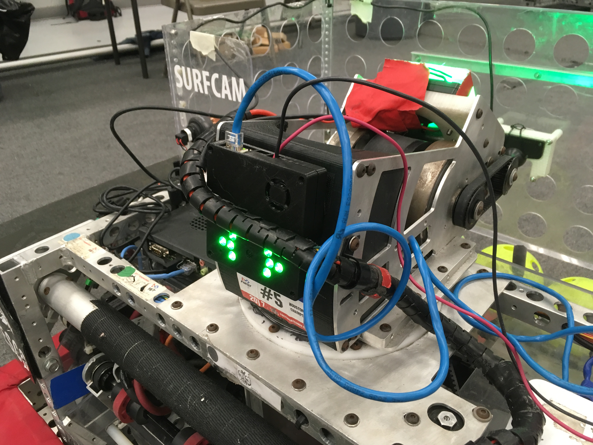

Case Study: Aiming Using Vision
===============================

.. Summary
1. You can accurately and quickly aim your robot using only a limelight and your drivetrain.
2. We added the limelight to a robot, implemented the code and tuned it in less than 1hr.

Using high-framerate vision tracking, it is now possible to use the vision pipeline directly as the “sensor” in a PID control loop to guide your robot or turret.  In order to test this idea we added a limelight to our 2017 FRC robotand made it aim at vision targets using nothing more than the drivetrain and the networks table data being reported by the limelight. 

In this example, our test candidate was our 2017 robot which uses a 6-wheel drivetrain with colson wheels.  Here is a picture of us adding a limelight onto the robot in order to do this test.  If you look closely, you can also see elements of our 2017 vision system which will not be used in this test.

Next we added some code to the robot which would run whenever the driver holds a button on the joystick.  This robot used "tank" style driving so the OperatorControl function was generating a 'left_command' value and a 'right_command' value to control the left and right sides of the drivetrain.  After the normal control code, we added a block of code like this:

.. code-block:: c++
	
	float Kp = -0.1f;  // Proportional control constant

	std::shared_ptr<NetworkTable> table = NetworkTable::GetTable("limelight");
	float tx = table->GetNumber("tx");

	if (joystick->GetRawButton(9))
	{
		float heading_error = tx;
        	steering_adjust = Kp * tx;
        	
		left_command+=steering_adjust;
        	right_command-=steering_adjust;
	}

Right off the bat, this mostly worked.  The robot turns in the direction of the target automatically whenever you are holding the button.  If you move the target around, the robot turns to follow the target.  However, using the live video feed on the dashboard, we could see that there was one big problem:  The robot wasn't always making it all the way to perfectly align with the target.  In some games with small targets, (like 2016 and 2017) this wouldn’t be good enough.

There are a few ways to approach this problem.  What we have implemented so far is a simple proportional control loop.  We calculated the error in heading and multiplied that by a constant, thus making a motor command which is proportional to the error.  As the error goes to zero, our command will go to zero.  The problem is that there is a lot of friction involved when the robot tries to turn.  Very small commands will not turn the robot at all.  At small angles, the command can become too small to actually move the robot.  You might find that your robot reaches its target well when you start out with a large targeting error but it just can’t aim at all if you start out really close.  

There are a few ways to solve this problem but here is a really simple solution.  We used a concept the “minimum command”.  If the error is bigger than some threshhold, just add a constant to your motor command which roughly represents the minimum amount of power needed for the robot to actually move (you actually want to use a little bit less than this).  The new code looks like this:

.. code-block:: c++
	
	float Kp = -0.1f;
	float min_command = 0.05f;

	std::shared_ptr<NetworkTable> table = NetworkTable::GetTable("limelight");
	float tx = table->GetNumber("tx");

	if (joystick->GetRawButton(9))
	{
		float heading_error = -tx;
		float steering_adjust = 0.0f;
    		if (tx > 1.0)
		{
			steering_adjust = Kp*heading_error - min_command;
		}
		else if (tx < 1.0)
		{
        		steering_adjust = Kp*heading_error + min_command;
		}
		left_command += steering_adjust;
		right_command -= steering_adjust;
	}

A little tuning on Kp and min_command should get your robot aiming directly at the target very accurately and quickly.  

