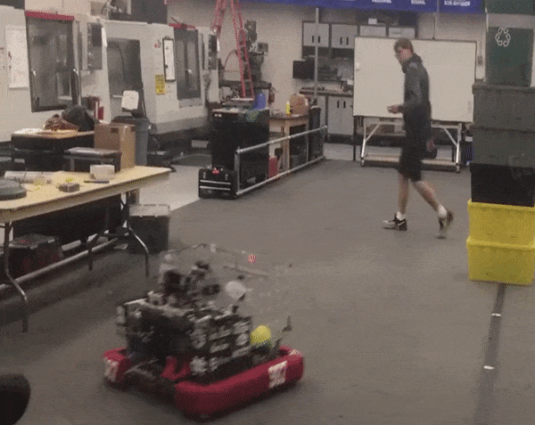

Case Study: Getting in Range
==========================================

.. Summary

1. Have your robot automatically drive to a desired distance from the target.
2. A very simple trick using a calibrated cross-hair.

FRC robots often need to be positioned a specific distance from a scoring goal in order for their scoring mechanism to work well.  You can use a simple proportional control loop along with limelight's calibrated cross-hair to very easily have your robot drive to a specific distance from the goal. 

For this example, you should make sure that your robot is aimed at the goal.  Later we will combine aiming and distance adjust into one function but for this example we are focusing only on the code that drives the robot to the correct distance. 

Similar to the aiming example, here we show a function which can be run in your robot's update loop.  

.. code-block:: c++

	float KpDistance = -0.1f;  // Proportional control constant for distance
	float current_distance = Estimate_Distance();  // see the 'Case Study: Estimating Distance' 

	if (joystick->GetRawButton(9))
	{
		float distance_error = desired_distance - current_distance;
        	driving_adjust = KpDistance * distance_error;
        	
		left_command += distance_adjust;
        	right_command += distance_adjust;
	}

With some tuning of the KpDistance setting, your robot should very quickly and accurately drive to the desired distance.  Compared to aiming, driving to the correct distance is usually easier because most robots drive forward and backward much easier than they turn in place.  

Next we'll describe a simple trick to make driving to the correct distance even easier.  Instead of actually calculating the distance, you can use the limelight cross-hair.  Just position your robot at your idea distance from the target and calibrate the y-position of the cross-hair.  Now your y-angle will report as 0.0 when your robot is at the correct distance.  Using this trick, you don't ever have to actually calculate the actual distance and your code can look something like this:

.. code-block:: c++

	float KpDistance = -0.1f; 
	
	std::shared_ptr<NetworkTable> table = NetworkTable::GetTable("limelight");
	float distance_error = table->GetNumber("ty");

	if (joystick->GetRawButton(9))
	{
        	driving_adjust = KpDistance * distance_error;
        	
		left_command += distance_adjust;
        	right_command += distance_adjust;
	}

If you need to change the shooting distance, just move your robot to the new distance and re-calibrate the limelight crosshair.  

.. image:: https://thumbs.gfycat.com/GraveEverlastingFawn-size_restricted.gif

Here is an example of a robot using the above idea.  Note how it backs up to the correct range automatically when the driver stops driving and presses the "aim" button:

