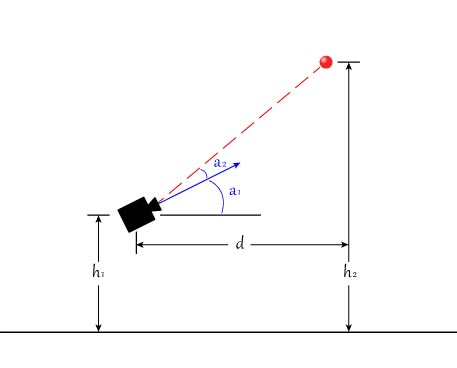

Case Study: Estimating Distance
===============================

* :ref:`Fixed-Angle-Camera`
* :ref:`Using-Area`

.. _Fixed-Angle-Camera:

Using a Fixed Angle Camera
~~~~~~~~~~~~~~~~~~~~~~~~~~~
If your vision tracking camera is mounted on your robot such that the angle between the ground plane and its line of sight does not change, then you can use this technique to very accurately calculate the distance to a target.  You can then use this distance value to either drive your robot forward and back to get into the perfect range or you can use it to adjust the power of a launching mechanism.  

See the below diagram.  In this situation all of the variables are known: the height of the target (h2) is known because it is a property of the field.  The height of your camera above the floor (h1) is known and its mounting angle is known (a1).  The limelight (or your vision system) can tell you the y angle to the target (a2).

We can solve for d using the following equation:

tan(a1+a2) = (h2-h1) / d

d = (h2-h1) / tan(a1+a2)

The tan function usually assumes that its input is measured in radians. To convert an angle measurement from degrees to radians, multiply the angle measurement by (3.14159/180.0). Essentially, 3.14 radians = 180 degrees. See the full code example below.

.. tabs::

	..tab:: Java

		.. code-block:: java

			NetworkTable table = NetworkTableInstance.getDefault().getTable("limelight");
			NetworkTableEntry ty = table.getEntry("ty");
			double targetOffsetAngle_Vertical = ty.getDouble(0.0);

			// how many degrees back is your limelight rotated from perfectly vertical?
			double limelightMountAngleDegrees = 25.0; 

			// distance from the center of the Limelight lens to the floor
			double limelightLensHeightInches = 20.0; 

			// distance from the target to the floor
			double goalHeightInches = 60.0; 

			double angleToGoalDegrees = limelightMountAngleDegrees + targetOffsetAngle_Vertical;
			double angleToGoalRadians = angleToGoalDegrees * (3.14159 / 180.0);
			
			//calculate distance
			double distanceFromLimelightToGoalInches = (goalHeightInches - limelightHeightInches)/tan(angleToGoalRadians);

	..tab:: c++

		.. code-block:: c++

			std::shared_ptr<NetworkTable> table = nt::NetworkTableInstance::GetDefault().GetTable("limelight");  
			double targetOffsetAngle_Vertical = table->GetNumber("ty",0.0);

			// how many degrees back is your limelight rotated from perfectly vertical?
			double limelightMountAngleDegrees = 25.0; 

			// distance from the center of the Limelight lens to the floor
			double limelightLensHeightInches = 20.0; 

			// distance from the target to the floor
			double goalHeightInches = 60.0; 

			double angleToGoalDegrees = limelightMountAngleDegrees + targetOffsetAngle_Vertical;
			double angleToGoalRadians = angleToGoalDegrees * (3.14159 / 180.0);
			
			//calculate distance
			double distanceFromLimelightToGoalInches = (goalHeightInches - limelightHeightInches)/tan(angleToGoalRadians);

When using this technique it is important to choose the mounting angle of your camera carefully.  You want to be able to see the target both when you're too close and too far away.  You also do not want this angle to change, so mount it securely and avoid using slots in your mounting geometry.

If you are having trouble figuring out what the angle a1 is, you can also use the above equation to solve for a1.  Just put your robot at a known distance (measuring from the lens of your camera) and solve the same equation for a1.

In the case where your target is at nearly the same height as your camera, this technique is not useful.

.. _Using-Area:

Using Area to Estimate Distance
~~~~~~~~~~~~~~~~~~~~~~~~~~~~~~~~

Another simple way to estimate distance is to use the area of the contour you are tracking.  This is a very simple method to implement but it does not give you extremely accurate results.  All you do is point your vision camera at the target from a known distance and take note of the area of the blob.  Make sure you're using an accurate representation of the real field's vision target and make sure you're pointing at it from your desired shooting location.  You can then do this from a few different distances and make a table out of these values.  In 2016 we used this method to adjust the aim of our 2-axis turret based on how far from the goal we were.

