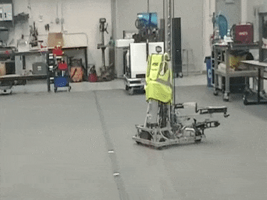

Case Study: Seeking 
===============================

.. Summary

1. Use a seeking behavior to find a target that is not initially visible to the camera.

Implementing a seeking behavior can be useful in a few situations.  In some games, the goal you are trying to score into may not be in a predictable location so you can't rely on dead-reconing autonomous code to get "close enough".  In 2009 for example, the goals were attached to the opponents robots which also driving around.  Another reason you might want to implement seeking is if your robot's drivetrain is not reliable/repeatable enough to put you in exactly the location you want.  Sometimes swerve drives or omni-directional drives can have trouble driving to presice locations (this is not a knock on swerve or omni-directional drivetrains; it is just more challenging to get them to drive to repeatable locations).  Some games have even allowed robot-robot interaction during autonomous mode.  In 2006 we often engaged in autonomous duels where the defense robots would try to knock the offense robots out of scoring position.  In this case you can't be sure of anything!  Hopefully this gets you thinking about some ways that having your robot automatically seek for a goal that it can't initially see might be useful.

Luckily, adding seeking logic to your robot is very easy.  To implement seeking, you simply have your robot scan for a target and once it finds it, start running the aiming code.  We will use the 'tv' or 'target valid' value reported by limelight to know if we see a target or not.  

.. code-block:: c++

	std::shared_ptr<NetworkTable> table = NetworkTable::GetTable("limelight");
	float tv = table->GetNumber("tv");
	float tx = table->GetNumber("tx");

	float steering_adjust = 0.0f;
	if (tv == 0.0f)
	{
		// We don't see the target, seek for the target by spinning in place at a safe speed.
		steering_adjust = 0.3f;		
	}
	else
	{
		// We do see the target, execute aiming code
		float heading_error = tx;
        	steering_adjust = Kp * tx;
	}
        	
	left_command+=steering_adjust;
	right_command-=steering_adjust;

Note that if your aiming code includes correcting the distance to the target, the robot behavior will be seeking followed by driving to the shooting distance as it aligns with the target.  All of this can be achieved with the very simple code shown above.

