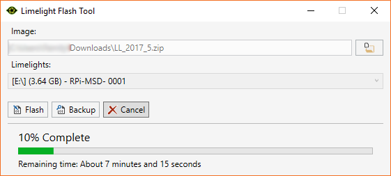

Getting Started
===============

This page will cover the content on the official website's "Getting Started" page.

* :ref:`mounting`
* :ref:`wiring`
* :ref:`imaging`
* :ref:`networking`
* :ref:`programming`

.. _mounting:

Mounting
~~~~~~~~~~~~~~~~~~~~~~~~~~~~~~~~~~~~~~~~~~~

Use four 1 1/4" 10-32 screws with nylock nuts to mount your Limelight. 

.. _wiring:

Wiring
~~~~~~~~~~~~~~~~~~~~~~~~~~~~~~~~~~~~~~~~~~~

.. note:: Limelight takes a 12V input, but is built to function down to 6V. Its LEDs have a constant brightness down to 7V.

Standard Wiring
------------------------------------------
* Do not run wires to your VRM.
* Run two wires from your limelight to a slot on your PDP.
* Add any breaker (5A, 10A, 20A, etc.) to the same slot on your PDP.
* Run an ethernet cable from your Limelight to your robot radio.

Power-over-Ethernet (PoE) Wiring
------------------------------------------
.. note:: PoE allows you to add both power and network connectivity to your Limelight via an Ethernet cable. 
.. warning:: This is not standard 44V PoE - this is why you must use a passive injector with 12V.
* Ensure that your Limelight's power jumper is set to the "E" position.
* Interface a passive `Passive PoE Injector <http://www.andymark.com/POE-p/am-3766.htm>`_. to your PDP.
* Add any breaker (5A, 10A, 20A, etc.) to the same slot on your PDP.
* Run an ethernet cable from your Limelight to your passive POE injector.

.. _imaging:

Imaging
~~~~~~~~~~~~~~~~~~~~~~~~~~~~~~~~~~~~~~~~~~~

.. note:: Limelight will receive software updates for improvements and features to accomodate the game.
.. _Downloads: https://limelightvision.io/pages/downloads
* Remove power from your limelight
* Download the latest flasher tool and image from from the Downloads_ Page.
* Install the flasher tool.
* Run a USB-MicroUSB cable from your laptop to your limelight.
* Apply power to your limelight
* Run the "Limelight Flash Tool" from the Windows search bar. It will also appear under the "Limelight" folder under the start menu applications folder
* It may take up to 20 seconds for Windows to recognize the camera. Press "cancel" on all subsequent Windows dialogs.
* Select the latest .zip image in your downloads folder
* Select an "RPI" device in the "Limelights" menu
* Click "Flash"
* Once flashing is complete, remove power from your limelight

.. _networking:

Networking Setup
~~~~~~~~~~~~~~~~~~~~~~~~~~~~~~~~~~~~~~~~~~~
While we reccomend a static IP address for reliability, some teams prefer dynamically assigned IP addresses.

Static IP Address (recommended for competition settings until further testing is completed)
---------------------------------------------------------------------------------------------
* Install bonjour from https://support.apple.com/kb/dl999?locale=en_US
* Power-up your robot, and connect your laptop to your robot's network.
* After your Limelight flashes its LED array, navigate to http://limelight.local:5801. This is the configuration panel.
* Navigate to the "Networking" tab.
* Enter your team number.
* Change your "IP Assignment" to "Static".
* Set your Limelight's IP address to "10.TE.AM.11".
* Set the Netmask to "255.255.255.0".
* Set the Gateway to "10.TE.AM.1".
* Click the "Update" button.
* Power-cycle your robot.
* You will now be access your config panel at http://10.TE.AM.11:5801, and your camera stream at http://10.TE.AM.11:5800
.. This is a comment. Mutli-line notes, warnings, admonitions in general need indented lines after the first line
.. note:: Q. Why do we reccommend a static IP? 

	A. First, it shaves multiple seconds off Limelight's boot time. Second, teams have historically had issues with DHCP assignment and mDNS responders on actual FRC fields.
.. note:: Q. How do I reset the IP address? 

	A. After your Limelight has booted, hold the config button on the front face of the camera until the LEDs start blinking. Power-cycle your robot, and your Limelight will have an automatically-assigned IP address.

Dynamic IP Address
------------------------------------------
* Power-up your robot, and connect your laptop to your robot's network.
* After your Limelight flashes its LED array, navigate to http://limelight.local:5801. This is the configuration panel.
* Navigate to the "Networking" tab.
* Enter your team number.
* Click the "Update" button.
* Power-cycle your robot.
* You can continue be access your config panel at http://limelight.local:5801, and your camera stream at http://limelight.local:5800

.. note:: While the camera has a NetBIOS name, we highly reccommend installing an mDNS responder such as Apple's Bonjour if you plan on using a Dynamic IP address.

.. _programming:

Basic Programming
~~~~~~~~~~~~~~~~~~~~~~~~~~~~~~~~~~~~~~~
For now, we just need to get data from the camera to your robot. Limelight posts targeting data to Network Tables at 100hz. The default update rate for NetworkTables is 10hz, but Limelight automatically overwrites it to allow for more frequent data transfer.

To get started, we recommend reading four values from the "limelight" Network Table at at least 100hz. Our code samples will show you exactly how to do this. The offsets to your target (in degrees) are sent as "tx" and "ty". These can be used to turn your robot, turn a turret, etc. The target's area, sent as "ta", may be used a rough indicator of distance to your target. Area is a value between 0 and 100, where 0 means that your target's hull area is 0% of the total image area, and 100 means that your target's hull fills the entire image. The rotation or "skew" of your target is returned as "ts". If all values are equal to zero, no targets exist.

In addition, you may control certain features by setting values in NetworkTables. 

Read the following from the "limelight" table

-tv 		Whether the limelight has any valid targets (0 or 1)
-tx			Horizontal Offset From Crosshair To Target (-27 degrees to 27 degrees)
-ty			Vertical Offset From Crosshair To Target (-20.5 degrees to 20.5 degrees)
-ta			Target Area (0% of image to 100% of image)								
-ts			Skew or rotation (-90 degrees to 0 degrees)
-tl 		The pipeline's latency contribution (ms) Add at least 11ms for image capture latency.

-------------------------------------------------

Write the following to the "limelight" table

-ledMode		Sets limelight's LED state

		-0	 	on
		-1 		off
		-2 		blink

-camMode		Sets limelight's operation mode

		-0	 	Vision processor
		-1 		Driver Camera (Increases exposure, disables vision processing)
-pipeline		Sets limelight's current pipeline

		-0 .. -9

Java
------------------------------------------
.. code-block:: java

	NetworkTable table = NetworkTableInstance.getDefault().getTable("limelight");
	NetworkTableEntry tx = table.getEntry("tx");
	NetworkTableEntry ty = table.getEntry("ty");
	NetworkTableEntry ta = table.getEntry("ta");
	double x = tx.getDouble(0);
	double y = ty.getDouble(0);
	double area = ta.getDouble(0);

LabView
------------------------------------------
Drag the below image into LabView to automatically generate the starter code for Limelight.
NOTE: Prepend a "/" to all NT values. Instead of "limelight/tx", use "/limelight/tx". Updating the LV snippet with this change asap.

.. image:: img/Labview_10.png

C++
------------------------------------------
.. code-block:: c++

	std::shared_ptr<NetworkTable> table = 	NetworkTable::GetTable("limelight");
	float targetOffsetAngle_Horizontal = table->GetNumber("tx");
	float targetOffsetAngle_Vertical = table->GetNumber("ty");
	float targetArea = table->GetNumber("ta");
	float targetSkew = table->GetNumber("ts"); 

Python
------------------------------------------
.. code-block:: python

    from networktables import NetworkTables
    
    table = NetworkTables.getTable("limelight")
    tx = table.getNumber('tx',None)
    ty = table.getNumber('ty',None)
    ta = table.getNumber('ta',None)
    ts = table.getNumber('ts',None)

    
