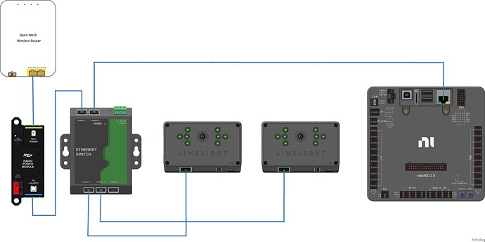

Wiring
~~~~~~~~~~~~~~~~~~~~~~~~~~~~~~~~~~~~~~~~~~~

Limelight takes a 12V input, but is built to function down to 4.5V. Its LEDs have a constant brightness down to 7V.

.. warning:: Do not use the REV radio power module to power your Limelight

Credit - Christian Femia
			

.. tabs::
	
	.. tab:: Standard Wiring

		* Do not run wires to your VRM.
		* Run two wires from your limelight to a slot on your PDP (NOT your VRM).
		* Add any breaker (5A, 10A, 20A, etc.) to the same slot on your PDP.
		* Run an ethernet cable from your Limelight to your robot radio.

	.. tab:: Power-over-Ethernet (PoE) Wiring

		PoE allows you to add both power and network connectivity to your Limelight via an Ethernet cable.

		.. warning:: This is not standard  IEEE 802.3 (44V-48V) PoE - this is why you must use a passive injector with 12V.
		
		* (LIMELIGHT 1 ONLY) Ensure that your Limelight's power jumper is set to the "E" position.
		* Connect a passive `Passive PoE Injector <http://www.revrobotics.com/rev-11-1210/>`_ to your PDP (NOT your VRM).
		* Add any breaker (5A, 10A, 20A, etc.) to the same slot on your PDP.
		* Run an ethernet cable from your Limelight to your passive POE injector.
