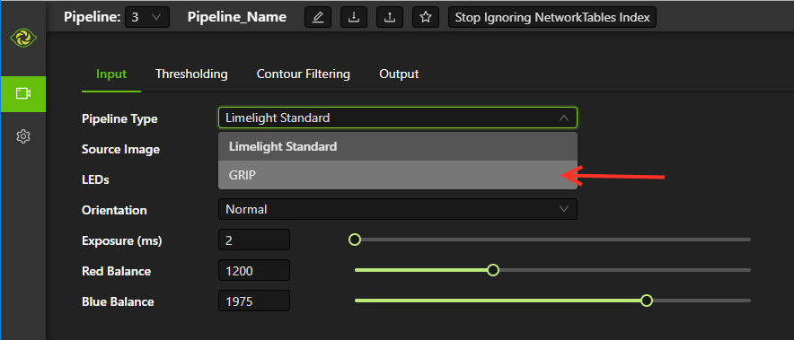
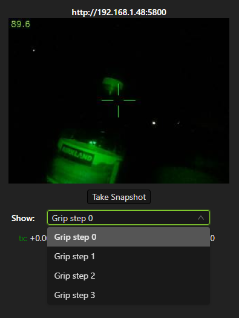

Running GRIP Pipelines on the Limelight
=======================================

.. Summary
1. Upload your custom GRIP pipeline into a limelight pipeline.

Once you have used GRIP to design a custom vision pipeline and exported your pipeline to a .LL file, it is time to run it on the limelight camera hardware.  The first step is to select which limelight pipeline you'd like to load your grip pipeline into.  In order to do this, you use the UI at the top of the limelight interface to select a pipeline.  Normally your robot (through network-tables) controls the currently active pipeline.  Our first step is to disable that functionality so that we can select the pipeline to edit:

Next, change the currently active pipeline using the dropdown box highlighted below.  

Next use the 'Upload' button to load your .LL file into this limelight pipeline.

And finally, change the pipeline mode from "LimeLight Standard" to "GRIP".

Once you have loaded a Grip pipeline, the UI changes slightly.  In place of the 'Thresholding' tab, you will have a 'GRIP' tab.  If your GRIP pipeline uses more than just the video feed as an input, you will have a list of additional inputs as shown below with upload buttons for uploading images or other data into them.  

.. image:: img/GRIP_GripTab.png

In addition, the video feed will have new options for displaying any intermediate images generated by your GRIP pipeline.

When you are using a GRIP pipeline, the settings on the Input, ContourFiltering, and Output tabs are still fully functional.  If you would prefer to do your contour filtering within GRIP, you can simply "open up" all of the limelight contour filtering options to allow all contours to pass through.

  