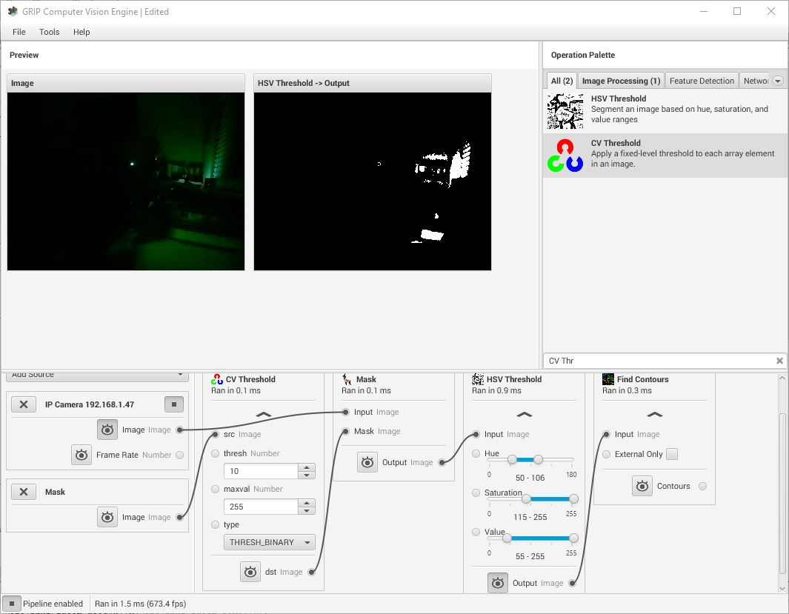

Using Grip to create Custom OpenCV Vision Pipelines
====================================================

.. Summary
1. You can use GRIP to grapically design custom vision pipelines.
2. Your custom vision pipeline can be loaded into a limelight and run in hardware.

Grip is a program developed by WPI for developing vision pipelines.  We have added a new export option to grip which allows you to export your custom vision pipeline and run it on a limelight camera with no extra programming needed.  Carefully designed Grip pipelines can run at the full 90fps framerate of the limelight camera.  

The first step in using GRIP is to download our build of Grip.  It can be downloaded from our downloads page.  When you run GRIP, you should see a screen like this:  

You can learn more about GRIP on this web page:
https://wpilib.screenstepslive.com/s/currentCS/m/vision/l/463566-introduction-to-grip

Accessing the Video Stream wthin GRIP
=====================================
Limelight has an additional video stream on port 5802 which can be accessed primarily for use with GRIP or other applications like it.  This video stream is uncompressed (or very lightly compressed) and has no cross-hair or other overlays drawn on the image.  It is important to use this video stream for developing your GRIP pipeline because the normal Limelight video feed is optimized for very low bandwidth and latency which causes the image to be relatively low quality and can have significant compression artefacts.  So to get your grip pipeline started, add an IP Camera input which uses the limelight as its input:

.. image: img/Grip_Add_IpCamera.jpg

How Limelight Handles Inputs to the Pipeline
============================================
It is important to understand how your limelight camera interfaces with the inputs to your vision pipeline.  Once your pipeline is loaded into the limelight camera, its inputs will be scanned.  The first input is always assumed to be the video feed from the camera so it is important that you structure your pipeline in this way.  Any additional inputs to the pipeline will recieve upload buttons in the limelight UI which will allow you to upload addtional images or data files as needed by your pipeline.  For now it is important to realize that the video stream should be the first input in your Grip Pipeline.

Generating output for the Limelight to use
==========================================
When your grip pipeline is loaded onto the limelight, it will also be scanned for output data in the form of contours, blobs, or rectangles.  If any of these outputs are found, the last one in the pipeline will be used as the 'results' of your vision pipeline.  You can use the built-in contour filtering features on the limelight with your grip pipeline or the built-in limelight contour filtering or any combination of them. In the example shown below, the output of the block highlighted in red would be passed on to the limelight targetting system.  Notice that this example pipline produces contours at an intermediate step and then filters them.  Only the final set of contours (or blobs or rectangles) will be passed on to the limelight targetting system.

.. image: img/Grip_SimplePipeline.jpg

Code Generation for Limelight
=============================
When you are ready to try running your pipeline in hardware on the limelight, it is time to use the code-generation function of GRIP.  We have added a new "Limelight" code generation target to the GRIP application.  Using this option will produce a <pipeline>.ll file which can be loaded into the limelight camera.  

.. image: img/Grip_CodeGeneration.jpg

