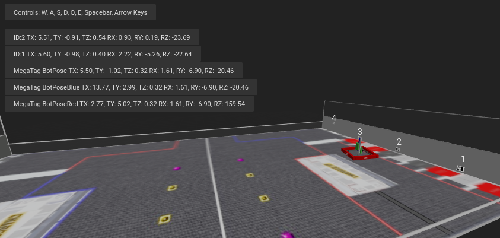
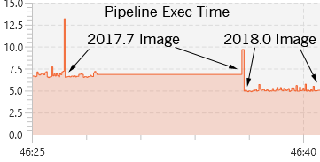

Software Change Log
==============================

Contact us or post to CD to suggest upgrades for Limelight!

2023.3 (2/13/23)
~~~~~~~~~~~~~~~~~~~~~~~~~~~~~~~~~~~~~~~~~~~~~~~~~~~~~~~~~~~~~~~~~~~~~~~~~~~~~~~~~~~~~~~~~~~~~~~~~~~~~~~~~~~~~~~~~~~~

Capture Latency (NT Key: "cl", JSON Results: "cl")
--------------------------------------------
The new capture latency entry represents the time between the end of the exposure of the middle row of LL's sensor and the beginning of the processing pipeline. 

Capture latency replaces the estimated "11ms" value we have recommended in the past. For each capture mode, we profiled the best-case image pipeline time (sensor, ISP, driver, memory transfer), 
and subtracted slightly less than half the total image capture time to arrive at the values posted to "cl". Our profiling procedure captures photons-to-memory latency with an LED Rig and a lot of profiling software.

New Quality Threshold for AprilTags
--------------------------------------------
Spurious AprilTags are now more easily filtered out with the new Quality Threshold slider. The default value set in 2023.3 should remove most spurious detections.

Camera Pose in Robot Space Override (NT Key: "camerapose_robotspace_set", "camerapose_robotspace")
--------------------------------------------
Your Limelight's position in robot space may now be adjusted on-the-fly. If the key is set to an array of zeros, the pose set in the web interface is used.
The current camera pose may now be read with "camerapose_robotspace" in networktables or "t6c_rs" in the top-level of the JSON results.

.. image:: https://thumbs.gfycat.com/VagueElderlyDove-size_restricted.gif

Higher Max Exposure
--------------------------------------------
The maximum exposure time is now 33ms (up from 12.5 ms). High-fps capture modes are still limited to (1/fps) seconds. 90hz pipelines, for example, will not have brighter images past 11ms exposure time.

Bugfixes
--------------------------------------------
* Fix LL3 MJPEG streams in shuffleboard
* Fix camMode - driver mode now produces bright, usable images.
* Exposure label has been corrected - each "tick" represents 0.01ms and not 0.1 ms

2023.2 (1/28/23)
~~~~~~~~~~~~~~~~~~~~~~~~~~~~~~~~~~~~~~~~~~~~~~~~~~~~~~~~~~~~~~~~~~~~~~~~~~~~~~~~~~~~~~~~~~~~~~~~~~~~~~~~~~~~~~~~~~~~

Making 3D easier than ever.

WPILib-compatible Botposes
--------------------------------------------
Botpose is now even easier to use out-of-the-box.

* New NetworkTables Key "botpose_wpired" - botpose, but with the origin at the right-hand side of the driverstation on the red side of the field.
* New NetworkTables Key "botpose_wpiblue" - botpose, but with the origin at the right-hand side of the driverstation on the blue side of the field.
* New Json arrays - botpose_wpired, and botpose_wpiblue

These match the WPILib Coordinate systems. Here's an example:
		

All botposes are printed directly in the field-space visualizer in the web interface, making it easy to confirm at a glance that everything is working properly.

Easier access to 3D Data (Breaking Changes)
--------------------------------------------
RobotPose in TargetSpace is arguably the most useful data coming out of Limelight with repsect to AprilTags. Using this alone, you can perfectly alighn a drivetrain with an AprilTag on the field.
Until now, this data has been buried in the JSON dump. In 2023.2, all 3D data for the primary in-view AprilTag is accessible over NT.

* NetworkTables Key "campose" is now "camerapose_targetspace"
* NetworkTables Key "targetpose" is now "targetpose_cameraspace"
* New NetworkTables Key - "targetpose_robotspace"
* New NetworkTables Key - "botpose_targetspace"

Neural Net Upload
--------------------------------------------
Upload teachable machine models to the Limelight Classifier Pipeline. Make sure they are Tensorflow Lite EdgeTPU compatible models.
Upload .tflite and .txt label files separately.

2023.1 (1/19/23)
~~~~~~~~~~~~~~~~~~~~~~~~~~~~~~~~~~~~~~~~~~~~~~~~~~~~~~~~~~~~~~~~~~~~~~~~~~~~~~~~~~~~~~~~~~~~~~~~~~~~~~~~~~~~~~~~~~~~

MegaTag and Performance Boosts

Correcting A Mistake
--------------------------------------------
The default marker size parameter in the UI has been corrected to 152.4mm (down from 203.2mm). This was the root of most accuracy issues. While it is sometimes acceptable to measure tags by their outermost border, the Limelight interface uses the detection corner distance (black box side length).

Increased Tracking Stability
--------------------------------------------
There are several ways to tune AprilTag detection and decoding. We’ve improved stability across the board, especially in low light / low exposure environments.

Ultra Fast Grayscaling
--------------------------------------------
Grayscaling is 3x-6x faster than before. Teams will always see a gray video stream while tracking AprilTags. While grayscaling was never very expensive, we want to squeeze as much performance out of the hardware as possible.

Cropping For Performance
--------------------------------------------
AprilTag pipelines now have crop sliders. Cropping your image will result in improved framerates at any resolution. AprilTag pipelines also support the dynamic “crop” networktables key. In case you missed it last year, dynamic cropping with the “Crop” NT key was added at the request of one of the best teams in the world in 2022 to improve shoot-on-the-move reliability.
Note the framerate increase from ~55fps to ~80fps.

.. image:: https://thumbs.gfycat.com/HandyCompleteHerring-size_restricted.gif

Easier Filtering
--------------------------------------------
There is now a single “ID filter” field in AprilTag pipelines which filters JSON output, botpose-enabled tags, and tx/ty-enabled tags. The dual-filter setup was buggy and confusing.

Breaking Change
--------------------------------------------
The NT Key “camtran” is now “campose”

JSON update
--------------------------------------------
"botpose" is now a part of the json results dump

Field Space Visualizer Update
--------------------------------------------
The Field-space visualizer now shows the 2023 FRC field. It should now be easier to judge botpose accuracy at a glance.

Limelight MegaTag (new botpose)
--------------------------------------------
My #1 priority has been rewriting botpose for greater accuracy, reduced noise, and ambiguity resilience. Limelight’s new botpose implementation is called MegaTag. Instead of computing botpose with a dumb average of multiple individual field-space poses, MegaTag essentially combines all tags into one giant 3D tag with several keypoints. This has enormous benefits.

The following GIF shows a situation designed to induce tag flipping:
Green Cylinder: Individual per-tag bot pose
Blue Cylinder: 2023.0.1 BotPose
White Cylinder: New MegaTag Botpose

Notice how the new botpose (white cylinder) is extremely stable compared to the old botpose (blue cylinder). You can watch the tx and ty values as well.

.. image:: https://thumbs.gfycat.com/ConfusedQuerulousLiger-size_restricted.gif

Here’s the full screen, showing the tag ambiguity:

.. image:: https://thumbs.gfycat.com/ElementaryCarefulHoopoe-size_restricted.gif

Here are the advantages:

Botpose is now resilient to ambiguities (tag flipping) if more than one tag is in view (unless they are close and coplanar. Ideally the keypoints are not coplanar).
Botpose is now more resilient to noise in tag corners if more than one tag is in view. The farther away the tags are from each other, the better.
This is not restricted to planar tags. It scales to any number of tags in full 3D and in any orientation. Floor tags and ceiling tags would work perfectly.

Here’s a diagram demonstrating one aspect of how this works with a simple planar case. The results are actually better than what is depicted, as the MegaTag depicted has a significant error applied to three points instead of one point. As the 3D combined MegaTag increases in size and in keypoint count, its stability increases.

.. image:: https://downloads.limelightvision.io/documents/MEGATAG.png

Nerual Net upload is being pushed to 2023.2!

2023.0.0 and 2023.0.1 (1/11/23)
~~~~~~~~~~~~~~~~~~~~~~~~~~~~~~~~~~~~~~~~~~~~~~~~~~~~~~~~~~~~~~~~~~~~~~~~~~~~~~~~~~~~~~~~~~~~~~~~~~~~~~~~~~~~~~~~~~~~

Introducing AprilTags, Robot localization, Deep Neural Networks, a rewritten screenshot interface, and more.

Features, Changes, and Bugfixes
--------------------------------------------

* New sensor capture pipeline and Gain control

	* Our new capture pipeline allows for exposure times 100x shorter than what they were in 2022. 
	  The new pipeline also enables Gain Control. This is extremely important for AprilTags tracking, and will serve to make retroreflective targeting more reliable than ever. Before Limelight OS 2023, Limelight's sensor gain was non-deterministic (we implemented some tricks to make it work anyways).
      
	* With the new "Sensor Gain" slider, teams can make images darker or brighter than ever before without touching the exposure slider. Increasing gain will increase noise in the image.
	
	* Combining lower gain with the new lower exposure times, it is now possible to produce nearly completely black images with full-brightness LEDs and retroreflective targets. This will help mitigate LED and sunlight reflections while tracking retroreflective targets.

	* By increasing Sensor Gain and reducing exposure, teams will be able to minimize the effects of motion blur due to high exposure times while tracking AprilTags.

	* We have managed to develop this new pipeline while retaining all features - 90fps, hardware zoom, etc.

* More Resolution Options

	* There two new capture resolutsions for LL1, LL2, and LL2+: 640x480x90fps, and 1280x960x22fps

* Optimized Web Interface

	* The web gui will now load and initialize up to 3x faster on robot networks.

* Rewritten Snapshots Interface

	* The snapshots feature has been completely rewritten to allow for image uploads, image downloads, and image deletion. There are also new APIs for capturing snapshots detailed in the documentation.

* SolvePnP Improvements

	* Our solvePnP-based camera localization feature had a nasty bug that was seriously limiting its accuracy every four frames. This has been addressed, and a brand new full 3D canvas has been built for Retroreflective/Color SolvePNP visualizations.

* Web Interface Bugfix

	* There was an extremely rare issue 2022 that caused the web interface to permanently break during the first boot after flashing, which would force the user to re-flash. The root cause was found and fixed for good.

* New APIs

	* Limelight now include REST and Websocket APIs. REST, Websocket, and NetworkTables APIs all support the new JSON dump feature, which lists all data for all targets in a human readable, simple-to-parse format for FRC and all other applications.

Zero-Code Learning-Based Vision & Google Coral Support
----------------------------------------------------------------------------------------

	* Google Coral is now supported by all Limelight models. Google Coral is a 4TOPs (Trillions-of-Operations / second) USB hardware accelerator that is purpose built for inference on 8-bit neural networks.
	* Just like retroreflective tracking a few years ago, the barrier to entry for learning-based vision on FRC robots has been too high for the average team to even make an attempt. We have developed all of the infrastructure required to make learning-based vision as easy as retroreflective targets with Limelight.
	* We have a cloud GPU cluster, training scripts, a dataset aggregation tool, and a human labelling team ready to go. We are excited to bring deep neural networks to the FRC community for the first time.

	* We currently support two types of models: Object Detection models, and Image classification models.
		* Object detection models will provide "class IDs" and bounding boxes (just like our retroreflective targets) for all detected objects. This is perfect for real-time game piece tracking.
			* Please contribute to the first-ever FRC object detection model by submitting images here: https://datasets.limelightvision.io/frc2023
			* Use tx, ty, ta, and tclass networktables keys or the JSON dump to use detection networks

		* Image classification models will ingest an image, and produce a single class label. 
			* To learn more and to start training your own models for Limelight, check out Teachable Machine by google.
			* https://www.youtube.com/watch?v=T2qQGqZxkD0
			* Teachable machine models are directly compatible with Limelight.
			* Image classifiers can be used to classify internal robot state, the state of field features, and so much more.
			* Use the tclass networktables key to use these models.

	* Limelight OS 2023.0 does not  provide the ability to upload custom models. This will be enabled shortly in 2023.1 

Zero-Code AprilTag Support
--------------------------------------------

* AprilTags are as easy as retroreflective targets with Limelight. Because they have a natural hard filter in the form of an ID, there is even less of a reason to have your roboRIO do any vision-related filtering.
* To start, use tx, ty, and ta as normal. Zero code changes are required. Sort by any target characteristic, utilize target groups, etc.
* Because AprilTags both always square and always uniquely identifiable, they provide the perfect platform for full 3D pose calculations.
* The feedback we've received for this feature in our support channels has been extremely positive. We've made AprilTags as easy as possible, from 2D tracking to a full 3D robot localization on the field 
* Check out the Field Map Specification and Coordinate System Doc for more detailed information.
* There are four ways to use AprilTags with Limelight:

* AprilTags in 2D
	* Use tx, ty, and ta. Configure your pipelines to seek out a specific tag ID.
	* <gif>

* Point-of-Interest 3D AprilTags
	* Use tx and ty, ta, and tid networktables keys. The point of interest offset is all most teams will need to track targets do not directly have AprilTags attached to them.
	* <gif>
		
* Full 3D
	* Track your LL, your robot, or tags in full 3D. Use campose or json to pull relevant data into your roboRio.
	* <gif>

* Field-Space Robot Localization
	* Tell your Limelight how it's mounted, upload a field map, and your LL will provide the field pose of your robot for use with the WPILib Pose Estimator.
	* Our field coordinate system places (0,0) at the center of the field instead of a corner.
	* Use the botpose networktables key for this feature.
	* <gif>

2022.3.0 (4/13/22)
~~~~~~~~~~~~~~~~~~~~~~~~~~~~~~~~~~~~~~~~~~~~~~~~~~~~~~~~~~~~~~~~~~~~~~~~~~~~~~~~~~~~~~~~~~~~~~~~~~~~~~~~~~~~~~~~~~~~

Bugfixes and heartbeat.

Bugfixes
----------------

* Fix performance, stream stability, and stream lag issues related to USB Camera streams and multiple stream instances.

Features and Changes
----------------------

* "hb" Heartbeat NetworkTable key
	* The "hb" value increments once per processing frame, and resets to zero at 2000000000.

2022.2.3 (3/16/22)
~~~~~~~~~~~~~~~~~~~~~~~~~~~~~~~~~~~~~~~~~~~~~~~~~~~~~~~~~~~~~~~~~~~~~~~~~~~~~~~~~~~~~~~~~~~~~~~~~~~~~~~~~~~~~~~~~~~~

Bugfixes and robot-code crop filtering.

Bugfixes
----------------

* Fix "stream" networktables key and Picture-In-Picture Modes
* Fix "snapshot" networktables key. Users must set the "snapshot" key to "0" before setting it to "1" to take a screenshot.
* Remove superfluous python-related alerts from web interface

Features and Changes
----------------------

* Manual Crop Filtering
	* Using the "crop" networktables array, teams can now control crop rectangles from robot code.
	* For the "crop" key to work, the current pipeline must utilize the default, wide-open crop rectangle (-1 for minX and minY, +1 for maxX and +1 maxY).
	* In addition, the "crop" networktable array must have exactly 4 values, and at least one of those values must be non-zero.

2022.2.2 (2/23/22)
~~~~~~~~~~~~~~~~~~~~~~~~~~~~~~~~~~~~~~~~~~~~~~~~~~~~~~~~~~~~~~~~~~~~~~~~~~~~~~~~~~~~~~~~~~~~~~~~~~~~~~~~~~~~~~~~~~~~

Mandatory upgrade for all teams based on Week 0 and FMS reliability testing.

Bugfixes
----------------

* Fix hang / loss of connection / loss of targeting related to open web interfaces, FMS, FMS-like setups, Multiple viewer devices etc.

Features and Changes
----------------
* Crop Filtering
	* Ignore all pixels outside of a specified crop rectangle
	* If your flywheel has any sweet spots on the field, you can make use of the crop filter to ignore the vast majority of pixels in specific pipelines. This feature should help teams reduce the probability of tracking non-targets.
	* If you are tracking cargo, use this feature to look for cargo only within a specific part of the image. Consider ignoring your team's bumpers, far-away targets, etc.
	* .. image:: https://thumbs.gfycat.com/ChillyWhimsicalGander-size_restricted.gif

* Corners feature now compatible with smart target grouping
	* This one is for the teams that want to do more advanced custom vision on the RIO
	* "tcornxy" corner limit increased to 64 corners
	* Contour simplification and force convex features now work properly with smart target grouping and corner sending 
	* .. image:: https://thumbs.gfycat.com/DaringTatteredBlowfish-size_restricted.gif

* IQR Filter max increased to 3.0
* Web interface live target update rate reduced from 30fps to 15fps to reduce bandwidth and cpu load while the web interface is open

2022.1 (1/25/22)
~~~~~~~~~~~~~~~~~~~~~~~~~~~~~~~~~~~~~~~~~~~~~~~~~~~~~~~~~~~~~~~~~~~~~~~~~~~~~~~~~~~~~~~~~~~~~~~~~~~~~~~~~~~~~~~~~~~~

Bugfixes
----------------

* We acquired information from one of our suppliers about an issue (and a fix!) that affects roughly 1/75 of the CPUs specifically used in Limelight 2 (it may be related to a specific batch). It makes sense, and it was one of the only remaining boot differences between the 2022 image and the 2020 image.

* Fix the upload buttons for GRIP inputs and SolvePNP Models

Features
----------------

* Hue Rainbow
	* The new hue rainbow makes it easier to configure the hue threshold. Here’s an example of filtering for blue pixels:
	* .. image:: https://thumbs.gfycat.com/BoldDishonestAntarcticgiantpetrel-size_restricted.gif

* Hue Inversion
	* The new hue inversion feature is a critical feature if you want to track red objects, as red is at both the beginning and the end of the hue range:
	* If you’re trying to track cargo, the aspect ratio filter (set a tight range around “1”) and the fullness filter (you want above 70%) should work quite well. Explicit “circle” filtering is relatively slow and wont work as well as people assume.
	* .. image:: https://thumbs.gfycat.com/MeekSnarlingFluke-size_restricted.gif

* New Python Libraries
	* Added scipy, scikit-image, pywavelets, pillow, and pyserial to our python sandbox.

2022.0 and 2022.0.3 (1/15/22)
~~~~~~~~~~~~~~~~~~~~~~~~~~~~~~~~~~~~~~~~~~~~~~~~~~~~~~~~~~~~~~~~~~~~~~~~~~~~~~~~~~~~~~~~~~~~~~~~~~~~~~~~~~~~~~~~~~~~

This is a big one. Here are the four primary changes:

Features
----------------

* Smart Target Grouping
	* Automatically group targets that pass all individual target filters.
	* Will dynamically group any number of targets between -group size slider minimum- and -group size slider maximum-
	* .. image:: https://thumbs.gfycat.com/WetImmediateEarthworm-size_restricted.gif

* Outlier Rejection
	* While this goal is more challenging than other goals, it gives us more opportunities for filtering. Conceptually, this goal is more than a “green blob.” Since we know that the goal is comprised of multiple targets that are close to each other, we can actually reject outlier targets that stand on their own.
	* You should rely almost entirely on good target filtering for this year’s goal, and only use outlier rejection if you see or expect spurious outliers in your camera stream. If you have poor standard target filtering, outlier detection could begin to work against you!
	* .. image:: https://thumbs.gfycat.com/CoolQualifiedHedgehog-size_restricted.gif

* Limelight 2022 Image Upgrades
	We have removed hundreds of moving parts from our software. These are the results:

	* Compressed Image Size: 1.3 GB in 2020 → 76MB for 2022 (Reduced by a factor of 17!)
	* Download time: 10s of minutes in 2020 → seconds for 2022
	* Flash time: 5+ minutes in 2020 → seconds for 2022
	* Boot time: 35+ seconds in 2020 → 14 seconds for 2022 (10 seconds to LEDS on)

* Full Python Scripting
    Limelight has successfully exposed a large number of students to some of the capabilities of computer vision in robotics. With python scripting, teams can now take another step forward by writing their own image processing pipelines.

	* .. image:: https://thumbs.gfycat.com/SpotlessGlisteningCygnet-size_restricted.gif
    * Limelight handles the hardware, camera interfacing, networking, streaming, and basic image pre-processing. All you need to do is write one python function called runPipeline().
    * One of the most important features we offer is the one-click crosshair. The crosshair, dual crosshair, tx, ty, ta, ts, tvert, and all other standard limelight NetworkTables readings will automatically latch to the contour you return from the python runPipeline() function.
    * Write your own real-time visualizations, thresholding, filtering, and bypass our backend entirely if desired.
        * Limelight’s python scripting has access to the full OpenCV and numpy libraries.
        * Beyond access to the image, the runPipeline() function also has access to the “llrobot” NetworkTables number array. Send any data from your robots to your python scripts for visualization or advanced applications (One might send IMU data, pose data, robot velocity, etc. for use in python scripts)
        * The runPipeline function also outputs a number array that is placed directly into the “llpython” networktables number array. This means you can bypass Limelight’s crosshair and other functionality entirely and send your own custom data back to your robots.
        * Python scripts are sandboxed within our c++ environment, so you don’t have to worry about crashes. Changes to scripts are applied instantly, and any error messages are printed directly to the web interface.

* This update is compatible with all Limelight Hardware, including Limelight 1.
* Known issues: Using hardware zoom with python will produce unexpected results.
* 2022.0.3 restores the 5802 GRIP stream, and addresses boot issues on some LL2 units by reverting some of the boot time optimizations. Boot time is increased to 16 seconds.

2020.4  (3/11/20)
~~~~~~~~~~~~~~~~~~~~~~~~~~~~~

2020.4 is another critical update that eliminates the intermittent 2-4 second crash that could occur during an abrupt mjpeg stream disconnection. This often happened at the very end of the match, and in some cases could happen during matches. 

2020.3  (2/25/20)
~~~~~~~~~~~~~~~~~~~~~~~~~~~~~

2020.3 is a critical update that addresses intermittent networking-related software restarts, and addresses a crash that would occur upon USB camera disconnection.

2020.2  (1/30/20)
~~~~~~~~~~~~~~~~~~~~~~~~~~~~~

2020.2 pushes Limelight's hardware even further by adding the ability to pan and zoom to any point. It also adds a brand new video mode and important bug fixes.  Let us know what features you would like to see in future updates!

Features
----------------
* 3x Hardware Zoom at 60 FPS

	* Our last update added 2x Hardware Zoom for all Limelight models at no cost whatsoever. We’ve managed to push our hardware zoom even further with 3x Hardware Zoom. All Limelight models are now capable of 3x Hardware Zoom at 60fps. This makes full-court tracking even easier for every team.
	* The following gif shows 1x, 2x, and 3x Hardware Zoom from the sector line (full court shot line):
	* .. image::  https://thumbs.gfycat.com/UnitedAntiqueKestrel-size_restricted.gif
	* This gif shows only 1x and 3x Hardware Zoom from the full-court sector line shot location:
	* .. image:: https://thumbs.gfycat.com/HeftySimpleAnemone-size_restricted.gif

* Hardware Panning

	* Robots capable of shooting from both long and short distances in 2020 would have found it difficult to use Hardware Zoom on their Limelights without the use of an active, adjustable Limelight mount. We have incorporated Hardware Panning to solve this problem. 
	* This gif shows Hardware Panning while using 3x Hardware Zoom. This should simplify mounting for teams who wish to use Hardware Zoom:
	* .. image:: https://thumbs.gfycat.com/UntidyElaborateDartfrog-size_restricted.gif
	* Hardware Panning on the  X and Y axes at 3x Hardware Zoom
	* .. image:: https://thumbs.gfycat.com/EdibleTimelyElver-size_restricted.gif 

Bugfixes
----------------
* Address driver issues that were breaking the color balance sliders
* Revert all networking-related drivers to 2019 season variants to address a small number of network performance reports from teams

2020.1  (1/16/20)
~~~~~~~~~~~~~~~~~~~~~~~~~~~~~
2020.1 adds one of Limelight's coolest features yet: 2x Hardware Zoom. This is not digital zoom, and it is now enabled for all Limelight versions.

Features
----------------
* 2x Hardware Zoom
	
	* Not Digital zoom
	* Enable 2x Hardware zoom to achieve vastly improved tracking at long range, and stable tracking at full-court distances.
	* This feature comes with absolutely no latency or framerate cost - tracking continues to execute at 90fps with no additional overhead.
	* Zoom from the autonomous starting line (~127" away):
	* .. image:: https://thumbs.gfycat.com/LawfulRapidArchaeocete-size_restricted.gif
	* Zoom from the front of the trench run (~210" away):
	* .. image:: https://thumbs.gfycat.com/GrippingWaterloggedEmperorshrimp-size_restricted.gif
	* Zoom from the front of the color wheel (~310" away):
	* .. image:: https://thumbs.gfycat.com/UnlinedFarawayArcticduck-size_restricted.gif
	* Zoom from the very back of the trench run (~420" away):
	* .. image:: https://thumbs.gfycat.com/PartialColorlessGiraffe-size_restricted.gif
	* Zoom from the sector line (nearly full-court):
	* .. image:: https://thumbs.gfycat.com/GreatGiftedAkitainu-size_restricted.gif

* Manual Crosshairs

	* Manually adjust single and dual crosshair locations with sliders in the web interface
	* .. image:: https://thumbs.gfycat.com/ElaborateUnimportantCuscus-size_restricted.gif
	
* New SolvePNP / 3D features (Still experimental)

	* We have added the "Force Convex" option to use only the outermost points of a target - this is necessary in 2020 due to the thin tape used for the hexagonal target.
	* .. image:: https://thumbs.gfycat.com/MemorableHastyFiddlercrab-size_restricted.gif
	* The "bind target" option has been added. This feature binds "tx" and "ty" to the 3D target. This is required to guide robots to score using 3D targets.
	* .. image:: https://thumbs.gfycat.com/DeadUnevenJackrabbit-size_restricted.gif
	* Finally, add the "Goal Z-Offset" option to automatically offset your desired target location in 3D space on the Z-axis.
	* In Infinite Recharge, the "Goal Z-Offset" would be used to track the center of the small, circular goal behind the hexagonal goal.
	* .. image:: https://thumbs.gfycat.com/AcidicHonoredElephant-size_restricted.gif
	
	* SolvePnP is still an experimental feature! We believe there are creative ways to play this game without SolvePnP, but we will continue to improve this feature.

* Color sensing with "tc"

	* Read the new "tc" array in Network Tables to obtain Red, Green, and Blue values at the crosshair's location. Adjust "Blue Balance" and "Red Balance" on the input tab to achieve perfect color sensing.

Bugfixes
----------------
* USB Camera functionality broken in 2020.0 is now fixed in 2020.1
* SolvePnP functionality broken in 2020.0 is now fixed in 2020.1
* SolvePnP properly uses the model center as the axis visualization center

2019.7  (4/5/19)
~~~~~~~~~~~~~~~~~~~~~~~~~~~~~
2019.7 adds two new features.

Features
----------------
* 160x120 30fps streaming
	
	* Smoother, lower-bandwidth streaming for teams that use wide-angle USB cameras. Our 180-degree camera stream bandwidth dropped from ~3.7mbps to ~1.8 mbps.
	* Change the stream resolution in the settings tab.
	* Changing the stream resolution on a Limelight with a wide-angle USB camera attached. No Picture-in-Picture, and normal stream rate.	
		* .. image:: img/20197_bandwidth.png

* Smart Speckle Rejection

	* Teams that have mounted their cameras in-line with the target this year have had to deal with unwanted LED reflections.
	* The area slider does not always solve this problem, as teams want to track small vision targets at large distances.
	* This new feature will automatically reject *relatively* small contours that have passed through all other filters.
	* As a robot moves away from a vision target (decreasing its size), SSR will automatically adjust to only reject *relatively* small contours.
	* .. image:: https://thumbs.gfycat.com/EachInsecureAustraliansilkyterrier-size_restricted.gif

Changes
----------------
* Tooltips

	* Tooltips are now avaiable on some Limelight controls
	* .. image:: https://thumbs.gfycat.com/SeparateHonestEthiopianwolf-size_restricted.gif

2019.6.1 Hotfix (3/14/19)
~~~~~~~~~~~~~~~~~~~~~~~~~~~~~
2019.6.1 fixes Grip uploads.

2019.6 (3/12/19)
~~~~~~~~~~~~~~~~~~~~~

2019.6 is all about reliability.

Bugfixes
----------------
* USB Cameras
	
	* Address issue that could cause some USB cameras to fail on boot.

* FMS

	* Make Limelight more (if not completely) resistant to FMS restarts and field / laptop networking changes.
	* Limelight will no longer hang after a sudden client networking change.

* Raw Contour Sorting (BREAKING CHANGE)

	* Intersection filters no longer affect raw contour sorting.

* Smartdashboard auto-posting

	*LL auto-posts certain pieces of information to SmartDashboard (IP Address, Interface url, etc.). The names of these values now contain the hostname.

Features & Changes
--------------------

* Significantly increase precision and stability of the compute3d feature. Translation and rotation measurements are stable at larger distances.
* Max Black Level Offset increased to 40 (from 25) for even darker images.
* New "Closest" sort options in the "Output" tab while "Dual Crosshair" mode is enabled.
	* Standard - Current "closest" sorting implementation with "Dual Crosshair" mode.
	* Standard V2 - Experimental, smart "closest" sorting implementation with "Dual Crosshair" mode.
	* Average of Crosshairs - "Closest" sort origin with "Dual Crosshair" mode is the average of the two crosshairs.
	* Crosshair A - "Closest" sort origin with "Dual Crosshair" mode is crosshair A.
	* Crosshair B - "Closest" sort origin with "Dual Crosshair" mode is crosshair B.
* New "LED Mode" pipeline options: "Left Half", "Right Half"
* Floating-point raw corner values while compute3D is enabled.
* Hide image decorations while using magic wands
* Larger stream in web interface

2019.5 (2/9/19)
~~~~~~~~~~~~~~~~~~~~~

With 2019.5 we are introducing the brand new compute3D camera localization feature. Only a handful of teams have ever attempted to add this feature to their vision systems, and now it is available to all Limelight 1 and Limelight 2 users. 

This is not a silver bullet for this year's game. We highly recommend thinking of creative ways to use the standard high-speed 90 fps tracking unless this feature is absolutely necessary.

.. image:: https://thumbs.gfycat.com/LeftHalfBluewhale-size_restricted.gif

All example gifs were created with an LL2 mounted on the side of a kitbot. This is why you will see slight changes in translation during turns.

Features
----------------
* High-Precision Mode and PnP
	
	* In the following gif, a Limelight 2 was placed 37 inches behind and 14.5 inches to the right of the target.
		* .. image:: https://thumbs.gfycat.com/ThirstyFailingGreatdane-size_restricted.gif
	* The Limelight was later turned by hand. Notice how the distances remain mostly unchanged:
		* .. image:: https://thumbs.gfycat.com/DisloyalUnfinishedAntipodesgreenparakeet-size_restricted.gif
	* With 2019.4, we introduced corner sending. This allowed advanced teams to write their own algorithms using OpenCV's solvePNP(). With 2019.5, this is all done on-board.
	* Upload a plain-text csv file with a model of your target. We have pre-built models of 2019 targets hosted on our website. All models must have a centered origin, and use counter-clockwise point ordering with inch scaling.
	* Enable the new high-res 960x720 mode, and then enable "Solve 3D" to aquire the position and rotation of your Limelight relative to your target.
	* Corner numbers are now displayed on the image for easier model creation and threshold tuning.
	* Read all 6 dimensions of your camera's transform (x,y,z,pitch,yaw,roll) by reading the "camtran" networktable number array.

* Black Level

	* With the new black level slider, thresholding is even easier. Increase the black level offset to further darken your images.
	* .. image:: https://thumbs.gfycat.com/FoolishUnimportantLacewing-size_restricted.gif

Breaking Changes
----------------

* The reported vertical FOV for LL2 has been fixed to match the listed value of 49.7 degrees. This will change your "ty" values

Bug Fixes
----------------

* Fix stream-only crash that could occur when fisheye USB cameras were attached.
* Fix rare hang caused by networking-related driver.
* Corner approximation is now always active.

2019.4 (1/26/19)
~~~~~~~~~~~~~~~~~~~~~

We believe all critical bug reports are covered with this release.

Features
----------------
* Corners
	
	* Send the corners of your target as two arrays (tcornx, tcorny) *NOW tcornxy by enabling "send corners" in the "Output" tab. This will further enable teams that are interested in advanced pipelines with methods like solvePNP().
	* Adjust corner approximation with the "corner approximation" slider in the "Output" tab.

Bug Fixes
----------------

* Fix hang + rare crash that would occur when two targets had exactly the same area, x coordinate, or y coordinate.
* Fix area calculation in dual- and tri-target modes.
* Optimize contour sorting for better performance.

2019.3 (1/19/19)
~~~~~~~~~~~~~~~~~~~~~
2019.3 addresses a number of bugs and feature requests.

Features
----------------
* Stream Rate (bandwidth reduction)
	
	* Set the stream rate to "low" in the settings page for a lower-bandwidth 15fps video stream.

* Raw Contours disabled in NetworkTables (bandwidth reduction)
	
	* Raw contours are now disabled by default. This will further reduce Limelight's overall bandwidth.
	* There are now ~180 fewer networktables entries submitted per second by default.
	* See the new "Raw Contours" pipeline option in the "Output" tab to re-enable raw contours. 

* Active Pipeline Index
	
	* Read the networktable key "getpipe" to get the true active pipeline index of the camera. This is updated at 90hz.
	* The active pipeline index is now written to the videostream underneath the FPS display.

* Left and Right Intersection Filters
	
	* Teams may now choose between "left" and "right" dual-contour intersection filters. The "above" and "below" intersection filters were added in 2019.2.

Bug Fixes
----------------

* Fix LabView Dashboard streaming bug introduced in 2019.2
* The webpage no longer requests icon fonts from a the internet. All fonts are stored locally. This should speed up interface loading.
* Reduce "driver mode" exposure.
* Fix "Distance Transform" GRIP implementation
* Fix 20-second communication delays caused by changing the hostname.

2019.2 (1/7/19)
~~~~~~~~~~~~~~~~~~~~~
2019.2 adds new features to better equip teams for the 2019 season.

* Intersection Filter

	* .. image:: https://thumbs.gfycat.com/ThunderousWholeDinosaur-size_restricted.gif
		:align: center

	* The all-new intersection filter will allow teams to better distinguish between different groups of contours. The filter extends contours to infinity, and checks where they would intersect.

* Direction Filter

	* .. image:: https://thumbs.gfycat.com/HalfUnselfishHarvestmen-size_restricted.gif
		:align: center

	* The new direction filter will allow teams to better distinguish between contours of different orientations.

* Additional Changes and Fixes
	
	* IP Address is auto-posted to SmartDashboard/Shuffleboard for easier event troubleshooting. We have had almost no reports of this being an issue, but this serves as another contingency feature.
	* Pipeline name is auto-posted to SmartDashboard/Shuffleboard
	* Access the width and height of the rough bounding box in pixels with new networktables keys.
	* Access the longest side and shortest side of the perfect bounding box in pixels with new networktables keys.
	* "Sort Mode" now applies to dual-contours
	* "Sort Mode" is now fixed
	* 5802 stream is less taxing on the camera

2019.1 (12/18/18)
~~~~~~~~~~~~~~~~~~~~~
2019.1 fixes all major bugs reported during the beta

* Performance is back to a steady 90fps. A driver issue was the root cause of our performance problems during beta
* IP and hostname settings actually apply and "stick"
* Magic Wands have been re-ordered to match those of Limelight 2018 software
* We now support Grip inputs like masks through the web interface
* NetworkTables freeze fixed

2019.0 (12/10/18)
~~~~~~~~~~~~~~~~~~~~~
With 2019, we are introducing GRIP support, a brand-new interface, and a cleaner flashing procedure.

* Grip Support
	
	* Build pipelines with GRIP For Limelight, and export "LL Script" files to upload to your camera.
	* Masks and NetworkTables support will be added in a future update
	* Expose a bare video stream at http://<limelighturl>:5802 for testing in grip
	
* All-new web interface
	
	* Smaller controls
	* More tooltips
	* Add the ability to turn off the LEDs from the interface
	* Move display combobox underneath stream for easier display switching
	* Faster communication to Limelight. New web tech allowed us to simplify other parts of our code.

* Flashing
	
	* We have migrated to "Balena Etcher"
	* Etcher is twice as fast and works on all platforms
	* Flash popups are fixed with the migration.
	
* Other
	
	* The LED Mode has been modified to allow for pipeline-specific LED Modes. LED MODE 0 is now "pipeline mode", while mode 1 is "force off"
	* Faster boot times in automatic IP assignment mode.
	* Optimizations and minor bug fixes

2018.5 (3/28/18)
~~~~~~~~~~~~~~~~~~~~~
2018.5 fixes a critical issue that would prevent users from tuning pipelines on snapshots.

2018.4 (3/19/18)
~~~~~~~~~~~~~~~~~~~~~
2018.4 adds new contour sorting options. These are fairly important for cube tracking this year, as teams don't necessarily want to track the largest cube in view. In many cases, teams want to track the cube that is closest to their intakes. Many users have had to use the raw contours feature to implement their own sorting, so we want to make this as easy as possible.

* Contour Sort Mode

	* Select between "largest", "smallest", "highest", "lowest", "leftmost", "rightmost", and "closest" sort options.
	* We feel that many teams will make use of the "closest" option for cube tracking.
	* .. image:: https://thumbs.gfycat.com/PlaintiveSizzlingEskimodog-size_restricted.gif
	
2018.3 (2/28/18)
~~~~~~~~~~~~~~~~~~~~~
2018.3 fixes a major networktables reconnection bug which would cause NetworkTables settings changes to not propagate to Limelight. Thanks to Peter Johnson and the WPILib team for pinpointing and fixing the underlying NT bug. This was (as far as we know) the last high-priority bug facing Limelight.

Settings changes such as ledMode, pipeline, and camMode should always apply to Limelight. You should no longer need workarounds to change Limelight settings while debugging, after restarting robot code, and after rebooting the roborio.

Changes
----------------
* Fix major NT syncing issue which broke settings changes (ledMode, pipeline, and camMode) during LabView debugging, and after a reset/reboot of the roborio.
* Eye-dropper wand:
	
	* The eye dropper wand uses the same 10 unit window for Hue, but now uses a 30 unit window for saturation and value. This means that thresholding is more often a one-click operation, rather than a multi-step process.
* Snapshots

	* Setting the snapshot value to "1" will only take a single snapshot and reset the value to 0. Snapshotting is throttled to 2 snapshots per second.
	* Snapshot limit increased to 100 images.
	* Snapshot selector area is now scrollable to support 100 images.
	* .. image:: https://thumbs.gfycat.com/ComplexConstantGalapagosalbatross-size_restricted.gif

2018.2 (2/10/18)
~~~~~~~~~~~~~~~~~~~~~
2018.2 fixes all known streaming bugs with various FRC dashboards. It also makes Limelight easier to tune and more versatile during events.

Features
----------------
* Thresholding wands
	
	* Setup HSV threshold parameters in a matter of clicks
	* The "Set" wand centers HSV parameters around the selected pixel
	* The "Add" wand adjusts HSV parameters to include the selected pixel
	* .. image:: https://thumbs.gfycat.com/FarHandyCanvasback-size_restricted.gif
	* The "Subtract" wand adjusts HSV paramters to ignore the selected pixel
	* .. image:: https://thumbs.gfycat.com/HoarseEnragedIslandwhistler-size_restricted.gif

* Snapshots
	
	* .. image:: https://thumbs.gfycat.com/WindyDefiantCrayfish-size_restricted.gif
	* Snapshots allow users to save what Limelight is seeing during matches or event calibration, and tune pipelines while away from the field.
	* Save a snapshot with the web interface, or by posting a "1" to the "snapshot" NetworkTables key
	* To view snapshots, change the "Image Source" combo box on the input tab. This will allow you to test your pipelines on snapshots rather than Limelight's camera feed
	* Limelight will store up to 32 snapshots. It will automatically delete old snapshots if you exceed this limit.

* New Streaming options
	
	* We've introduced the "stream" NetworkTables key to control Limelight's streaming mode. We've received requests for PiP (Picture-in-Picture) modes to better accomodate certain dashboards.
	* 0 - Standard - Side-by-side streams if a webcam is attached to Limelight
	* 1 - PiP Main - The secondary camera stream is placed in the lower-right corner of the primary camera stream.
	* 2 - PiP Secondary - The primary camera stream is placed in the lower-right corner of the secondary camera stream.

* Increase streaming framerate to 22fps

	* Look out for faster streams in an upcoming update

* Erosion and Dilation

	* Enable up to one iteration of both erosion and dilation. 
	* Erosion will slightly erode the result of an HSV threshold. This is useful if many objects are passing through a tuned HSV threshold.
	* Dilation will slightly inflate the result of an HSV threshold. Use this to patch holes in thresholding results.

* Restart Button
	
	* Restart Limelight's vision tracking from the web interface. This is only useful for teams that experience intermittent issues while debugging LabView code.

Optimizations
----------------

* Drop steady-state pipeline execution time to 3.5-4ms.

Bug Fixes
----------------

* Fix Shuffleboard streaming issues
* Fix LabView dashboard streaming issues

2018.1 (1/8/18)
~~~~~~~~~~~~~~~~~~~~~
* Red-Balance slider
* Blue-Balance slider
* Better default color balance settings
* Increased max exposure setting

2018.0 (1/3/18)
~~~~~~~~~~~~~~~~~~~~~
On top of a ton of new case studies, more detailed documentation, and a full example program for an autonomous STEAMWORKS shooter, the software has received a major upgrade.

Features
----------------
* New Vision Pipeline interface:

	* .. image:: https://thumbs.gfycat.com/UnfitLankyHadrosaurus-size_restricted.gif

	* Add up to 10 unique vision pipelines, each with custom crosshairs, thresholding options, exposure, filtering options, etc.
	* Name each vision pipeline.
	* Mark any pipeline as the "default" pipeline.
	* Instantly switch between pipelines during a match with the new "pipeline" NetworkTables value. This is useful for games that have multiple vision targets (eg. the gear peg and boiler from 2017). This is also useful for teams that need to use slightly different crosshair options per robot, field, alliance, etc.
	* Download vision pipelines from Limelight to backup or share with other teams.
	* Upload vision pipelines to any "slot" to use downloaded pipelines.
* Target "Grouping" option:
	* Instantly prefer targets that consist of two shapes with the "dual" grouping mode". "Single" and "Tri" options are also available
	* .. image:: https://thumbs.gfycat.com/ScalyDeficientBrahmanbull-size_restricted.gif
* New Crosshair Calibration interface:
	* "Single" and "Dual" crosshair modes.
	* "Single" mode is what Limelight utilized prior to this update. Teams align their robots manually, and "calibrate" to re-zero targeting values about the crosshair.
	* "Dual" mode is an advanced feature for robots that need a dynamic crosshair that automatically adjusts as a target's area / distance to target changes. We've used this feature on some of our shooting robots, as some of them shot with a slight curve. This feature will also be useful for robots with uncentered andor misaligned Limelight mounts.
 	* Separate X and Y calibration.
* Add Valid Target "tv" key to Network Tables.
* Add Targeting Latency "tl" key to Network Tables. "tl" measures the vision pipeline execution time. Add at least 11 ms for capture time.
* Draw additional rectangle to help explain aspect ratio calculation.
* Remove throttling feature, and lock Limelight to 90fps.
* Disable focusing on most web interface buttons. Fixes workflow problem reported by teams who would calibrate their crosshairs, then press "enter" to enable their robots.
* Post three "raw" contours and both crosshairs to Network Tables.
	* Access a raw contour with tx0, tx1, ta0, ta1, etc.
	* Access both raw crosshairs with cx0, cy0, cx1, cy1.
	* All x/y values are in normalized screen space (-1.0 to 1.0)
* Add "suffix" option to web interface. Allows users to add a suffix to their Limelights' hostnames and NetworkTables (e.g. limelight-boiler). This feature should only be utilized if teams intend to use multiple Limelights on a single robot.
* Display image version on web interface

Optimizations
----------------
* Decrease networking-related latency to ~0.2 ms from ~10ms (Thanks Thad House)
* Move stream encoding and jpg compression to third core, eliminating 10ms hitch (25 - 30ms hitch with two cameras) seen every six frames.
* Drop steady-state pipeline execution time to 5ms with SIMD optimizations.

* New Latency testing shows 22 ms total latency from photons to targeting information.
* Upgrade Network Tables to v4 (Thanks Thad House)
* Optimize contour filtering step. Latency no longer spikes when many contours exist.
* Much improved hysterisis tuning.
* Significantly improve responsiveness of webinterface<->limelight actions. 

Bugfixes
------------------
* Fix minor area value inaccuracy which prevented value from reaching 100% (maxed ~99%).
* Fix half-pixel offset in all targeting calculations
* Fix camera stream info not populating for NT servers started after Limelight's boot sequence. Regularly refresh camera stream info.
* Fix bug which caused aspect ratio to "flip" occasionally.
* Force standard stream output (rather than thresholded output) in driver mode.
* Fix bug which prevented LEDs from blinking after resetting Networking information

2017.7 (11/21/17)
~~~~~~~~~~~~~~~~~~~~~
* Improved contour sorting. Was favoring small contours over larger contours. 
* New Coordinate system: Center is (0,0). ty increases as the target moves "up" the y-axis, and tx increases as the target moves "right" along the x-axis.
* More accurate angle calculations (Pinhole camera model).
* Display targeting info (tx, ty, ta, and ts) on webpage
* Default targeting values are zeros. This means zeros are returned if no target is in view.
* New side-by-side webpage layout. Still collapses to single column on small devices.
* Continuous slider updates don't hurt config panel performance.
* Aspect ratio slider scaled such that 1:1 is centered.

2017.6 (11/13/17)
~~~~~~~~~~~~~~~~~~~~~
* New Imaging tool. Tested on Win7, Win8 and Win10.
* Post camera stream to cameraserver streams. Works with smart dashboard camera streams, but shuffleboard has known bugs here
* Quartic scaling on area sliders, quadratic scaling on aspect ratio sliders. This makes tuning much easier
* Organize controls into “input”, “threshold”, “filter”, and “output” tabs
* Continuous updates while dragging sliders
* Area sent to NT as a percentage (0-100)
* Image size down to 700MB from 2.1GB

2017.5 (11/9/17)
~~~~~~~~~~~~~~~~~~~~~
* Image size down to 2.1GB from 3.9GB
* Add driver mode and led mode apis 
* Set ledMode to 0, 1, or 2 in the limelight table.
* Set camMode to 0 or 1 in the limelight table.
* Add ability to toggle between threshold image and raw image via web interface (will clean up in later release)
* Post camera stream to network tables under CameraPublishing/limelight/streams (will need a hotfix)
* Add skew to targeting information (“ts” in limelight table)
* Add base “CommInterface” in anticipation of more protocols

2017.4 (10/30/17)
~~~~~~~~~~~~~~~~~~~~~~~~~~~~
* Lots of boot and shutdown bullet-proofing

.. dhcpcd and var/log/samba every 20 minutes

2017.3 (10/25/17)
~~~~~~~~~~~~~~~~~~~~~~~~~~~~~
* Hue range is 0-179 from 0-255
* Decrease max log size, clear logs, clear apt cache

2017.2 (10/23/17)
~~~~~~~~~~~~~~~~~~~~~~~~~~~~~~~
* Manual ISO sensitivity
* Minimum exposure increased to 2

2017.1 (10/21/17)
~~~~~~~~~~~~~~~~~~~~~~~~~~~~~~~~
* Optimizations

* “Convexity” changed to “Fullness”
* Exposure range set to 0-128 ms from 0-255 ms
* Support two cameras
* Fully support single-point calibration
