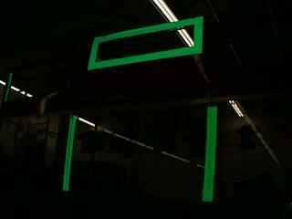
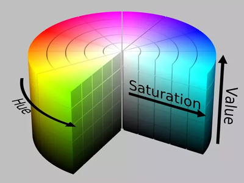
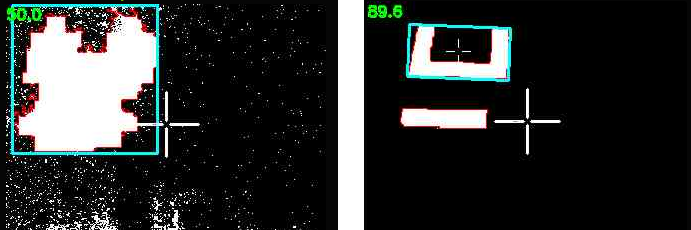
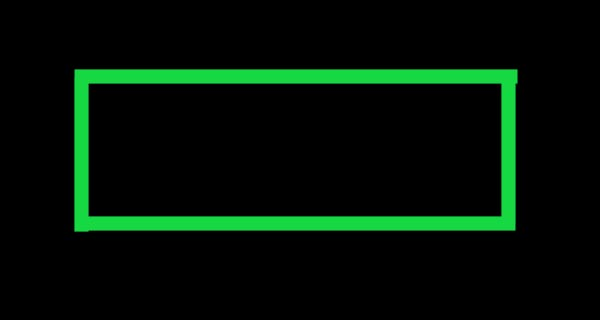
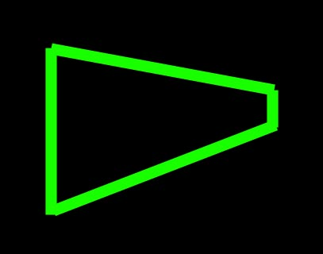
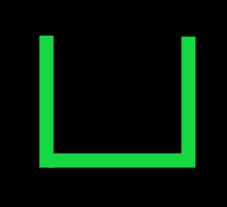
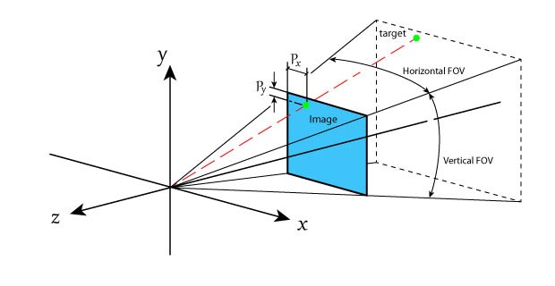
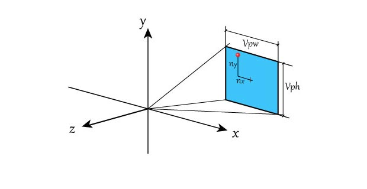
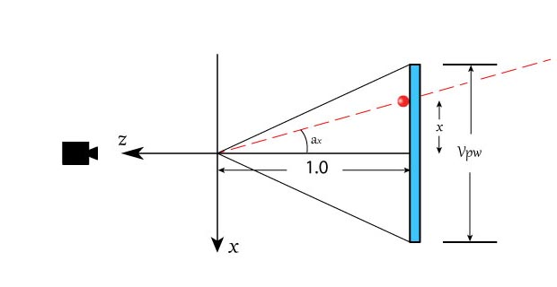

Additional Theory
==================
* :ref:`Vision-Targets`
* :ref:`Thresholding`
* :ref:`Contour-Filtering`
* :ref:`Output`

------------------------

.. _Vision-Targets:

Vision Targets
~~~~~~~~~~~~~~

------------------------

The FRC game designers often place reflective "vision targets" on the field in strategic locations.  These vision targets are usually made out of retro-reflective tape. Major scoring elements generally have vision targets that can be used to automatically aim. Below you can see two examples of some of the vision targets from the 2016 and 2017 FRC games.

.. image:: img/VisionTargetExamples.jpg
	:align: center

These retro-reflective vision targets have a very useful property: when light is shined at them, it will reflect directly back to the light source.  This is why Limelight has bright green LEDs surrounding its camera lens.  By setting the camera exposure very low while emitting a bright green light toward the target, we can aquire an image that is mostly black with a bright green vision target. This makes the job of aquiring the target relatively easy.

Here you can see an example of the ideal of image.  Notice how almost all of the detail in the image is gone due to the low exposure setting but the retro-reflective tape stands out brightly.

------------------------

.. _Thresholding:

Thresholding
~~~~~~~~~~~~~~~~~~~~~~

------------------------

Thresholding is the next critical component of most FRC vision tracking algorithms. It is the act of taking an image, and throwing away any pixels that aren't in a specific color range. The result of thresholding is generally a one-dimensional image in which a pixel is either "on" or "off. Thresholding works very well on images that are captured using the above strategy (low exposure, very dark image with a brightly illuminated vision target)

Limelight does thresholding in the HSV (Hue-Saturation-Value) colorspace. You may be used to thinking of colors in the RGB (Red-Green-Blue) colorspace.  HSV is just another way of representing color similar to the way cartesian coordinates or polar coordinates can be used to describe positions.  The reason we use the HSV colorspace is that the Hue can be used to very tightly select the green color that Limelight's leds output.  

It is critical to adjust your thresholding settings to eliminate as much as you can from the image. You will get the best results if you optimize each stage of your vision pipeline before moving to the next stage. The following image depicts the difference between improper and proper thresholding:

Sometimes things like ceiling lights or windows in an arena can be difficult to remove from the image using thresholding, which brings us to the next stage.

------------------------

.. _Contour-Filtering:

Contour Filtering
~~~~~~~~~~~~~~~~~~~~~~

------------------------

After thresholding, Limelight's vision pipeline generates a set of contours for the image.  A contour in is a curve surrounding a contiguous set of pixels.  Sometimes things like ceiling lights, arena scoreboards, windows and other things can make it past the thresholding step.  This is where contour filtering becomes useful.  The goal is to eliminate any contours which we know are not the target we are interested in.  

The first and easiest countour filter is to ignore any contours which are smaller than what our vision target looks like from our scoring distance.  Anything smaller than that size is obviously something farther away and should be ignored.  This is called area filtering.

The FRC vision targets often have some geometric property that can be exploited to help us filter contours. For example, if the vision target has a wide aspect ratio, we can filter out any contours that are not wide:

However, keep in mind that your camera may be looking at the target from an odd angle.  This can drastically affect the aspect ratio of its contour.  Be sure to test your settings from a variety of angles to ensure that you do not filter too aggressively and end up ignoring the vision target!

This next image target is very interesting.  It is one of the best designed vision targets in FRC (in our opinion). Limelight automatically calculates a value called the **fullness** of a contour.  **Fullness** is the ratio between the pixel area of the contour to its convex area.  This particular shape has a very low fullness and you almost never see any ceiling lights, windows, etc with such a low fullness.  So you can very effectively filter out the unwanted contours if your vision target looks like this one.

Limelight has many options for filtering contours. You can use these options along with what you know about the geometry properties of the particular vision target you are trying to track.

Currently, if multiple contours pass through your filtering options, the largest contour is chosen. In addition, the pipeline prefers to "lock" onto contours using hysteresis. This is a feature that helps prevent flickering between similar targets.

From Pixels to Angles
~~~~~~~~~~~~~~~~~~~~~
The end result of the vision pipeline is a pixel location of the best contour in the image. For most games, we can just aim at the center of the contour. Sometimes it is also useful to aim at the top-center or some other point but essentially we have a pixel coordinate for where we want to aim.  In order to compute the angles to this target, we need to use a little bit of trigonometry.

First we assume that we have a perfect "pinhole" camera.  In practice this can be far from the truth but the limelight's camera is very close.  (A fisheye lens would be far from this ideal as a counter-example.)  

The limelight camera has a horizontal field of view of 54 degrees and a vertical field of view of 41 degrees.  It captures images at 320x240 resolution.  We assume the center of the image is the optical azis of the camera (so the x and y angles for that location are 0,0).  Given these known values, we can use a little trigonometry to compute the angles for any pixel in the image.  

The below diagram shows an example target point which we want to compute angles for.  Pixel coordinates start at the upper left corner of the image and are positive to the right and down.  

Our first step will be to convert from pixel coordinates to normalized 2D coordinates where 0,0 is the center of the image and 1.0:

(px,py) = pixel coordinates, 0,0 is the upper-left, positive down and to the right

(nx,ny) = normalized pixel coordinates, 0,0 is the center, positive right and up

nx = (1/160) * (px - 159.5)   

ny = (1/120) * (119.5 - py)   

Next we define an imaginary view plane and compute its size.  For simplicity, we can choose to place this plane 1.0 unit in front of the camera location.  Here is a view looking down on the camera.  Our goal is to compute the view plane width and height as those values will be used to compute the angles later:

Given a distance of 1.0 unit and a known horizontal and vertical fov, we can compute the size of the view plane rectangle the following formulas:

vpw = 2.0*tan(horizontal_fov/2)

vph = 2.0*tan(vertical_fov/2)

Using these two values, we can now convert between normalized pixel coordinates and view plane coordinates using a simple multiply.

x = vpw/2 * nx;

y = vph/2 * ny;

Remember that we chose our view plane to be positioned at a distance of 1.0.  Now we have everything we need to compute the angles to the target point.

tan(ax) = x / 1

tan(ay) = y / 1

ax = atan2(1,x)

ay = atan2(1,y)

