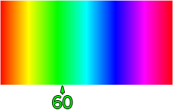

Vision Pipeline Tuning
===============================

To configure the limelight vision pipeline, first access its web interface at http://10.te.am.11:5801. If you have opted to use a dynamically assigned ip-address, access the interface at http://limelight.local:5801.

The "Tracking" page is comprised of four tuning tabs: 

* :ref:`Input`
* :ref:`Thresholding`
* :ref:`Contour-Filtering`
* :ref:`Output`

In addition, you can adjust your Limelight's crosshair by pressing the "calibrate crosshair" button while a target is in view. In a future release, crosshair calibration will move to the "output" tab.

----------

.. _Input:

Input
~~~~~~~~~~~~~~~~~~~

----------

The Input Tab hosts controls to change the raw camera image before it is passed through the processing pipeline.

Orientation
---------------------
Controls the orientation of incoming frames. Set it to "inverted" if your camera is mounted upside-down.

.. image:: https://thumbs.gfycat.com/KindTiredBellfrog-size_restricted.gif
	:align: center

Exposure
---------------------
Controls the camera's exposure setting in milliseconds. Think of a camera as a grid of light-collecting buckets - exposure time controls how long your camera's "buckets" are open per frame. Lowering the exposure time will effectively darken your image. Low and fixed exposure times are crucial in FRC, as they black-out the bulk of incoming image data. Well-lit retroreflective tape will stand out in a mostly black image, making vision processing a straightforward process.

.. image:: https://thumbs.gfycat.com/ZealousFrighteningClingfish-size_restricted.gif
	:align: center

----------

.. _Thresholding:

Thresholding
~~~~~~~~~~~~~~~~~~~~~~

----------

Thresholding is a critical component of most FRC vision tracking algorithms. It is the act of taking an image, and throwing away any pixels that aren't in a specific color range. The result of thresholding is generally a one-dimensional image in which a pixel is either "on" or "off.

.. image:: https://thumbs.gfycat.com/NaughtyWateryAngelwingmussel-max-14mb.gif
	:align: center
 
Video Feed
---------------
Controls which image is streamed from the mjpeg server. You should switch to the "threshold" image if you need to tune your HSV thresholding.

Hue
--------------------------------
Describes a "pure" color. A Hue of "0" describes pure red, and a hue of 1/3 (59 on the slider) describes pure green. Hue is useful because it doesn't change as a pixel "brightens" or "darkens". This is the most important parameter to tune. If you make your hue range as small as possible, you will have little if any trouble transitioning to an actual FRC field.

Saturation
--------------------------------
Describes the extent to which a color is "pure". Another way to think of this is how washed-out a color appears, that is, how much "white" is in a color. Low saturation means a color is almost white, and high saturation means a color is almost "pure".

Value
--------------------------------
Describes the darkness of a color, or how much "black" is in a color. A low value corresponds to a near-black color. You should absolutely increase the minimum value from zero, so that black pixels are not passed through the processing pipeline.

Thresholding Wands
--------------------------------

Wands enable users to click on Limelights's video stream to perform automatic HSV thresholding.
	* The "Set" wand centers HSV parameters around the selected pixel
	* The "Add" wand adjusts HSV parameters to include the selected pixel
	* The "Subtract" wand adjust HSV paramters to ignore the selected pixel
	*GIF

Erosion and Dilation
--------------------------------
Erosion slightly erodes the result of an HSV threshold. This is useful if many objects are passing through a tuned HSV threshold.
Dilation slightly inflates the result of an HSV threshold. Use this to patch holes in thresholding results.
	*GIF

----------

.. _Contour-Filtering:

Contour Filtering
~~~~~~~~~~~~~~~~~~~~~~

----------

After thresholding, Limelight applies a .... to generate a list of contours. After that, each contour is wrapped in a bounding rectangle, or "convex hull". Hulls are passed through a series of filters to determine the "best" hull. If multiple hulls pass through all filters, Limelight chooses the largest hulls.

Target Area
------------------
Controls the range of acceptable bounding-rectangle areas, as percentages of the screen. You can increase the minimum area to help filter-out stadium lights, and decrease the maximum value to help filter-out things like large displays near the field.

.. image:: https://thumbs.gfycat.com/CriminalWideCalf-size_restricted.gif
	:align: center

.. note:: The area slider is not linearly scaled, but quarticly scaled. This is done to provide extra precision near the lower-end of area values, where many FRC targets lie. In any case, an area slider should be quadratically scaled, as the area of a square scales quadratically with its side length.

Target Fullness
------------------
Fullness is the percentage of "on" pixels in the chosen contour's bounding rectangle. A solid rectangle target will have a near-1.0 fullness, while a U-shaped target will have a low fullness.

.. image:: https://thumbs.gfycat.com/UnripeOccasionalAnnashummingbird-size_restricted.gif
	:align: center

Target Aspect Ratio
---------------------------
Aspect ratio is defined by the width of the bounding rectangle of the chosen contour divided by its height. A low aspect ratio describes a "tall" rectangle, while a high aspect ratio describes a "wide" rectangle. 

.. image:: https://thumbs.gfycat.com/OrdinaryLeafyIndianpalmsquirrel-size_restricted.gif
	:align: center

.. note:: The aspect ratio slider is also quadratically scaled.

----------

.. _Output:

Output
~~~~~~~~~~~

----------

This tab controls what happens during the last stage of the vision pipeline

Targeting Region
-------------------
Controls the point of interest of the chosen contour's bounding rectangle. By default, the tracking parameters tx and ty represent the offsets from your crosshair to the center of the chosen rectangle. You can use another option if a target changes in size, or is comprised of two targets that sometimes blend together.

.. image:: https://thumbs.gfycat.com/RemarkableFragrantAmericankestrel-size_restricted.gif
	:align: center

Target Grouping for Combined Targets
-----------------------------------------
Controls target "grouping". Set to dual mode to look for "targets" that consist of two shapes, or tri mode to look for targets that consist of three shapes.

.. image:: https://thumbs.gfycat.com/ScalyDeficientBrahmanbull-size_restricted.gif
	:align: center

Crosshair Calibration
-------------------------
Controls the "origin" of your targeting values. Let's say a shooter on your robot needs to be calibrated such that it always points a bit left-of-center. You can line up your robot, click "calibrate," and all of your targeting values will be sent relative to your new crosshair. See the calibration page for more details!

.. image:: https://thumbs.gfycat.com/GraveEverlastingFawn-size_restricted.gif
	:align: center

